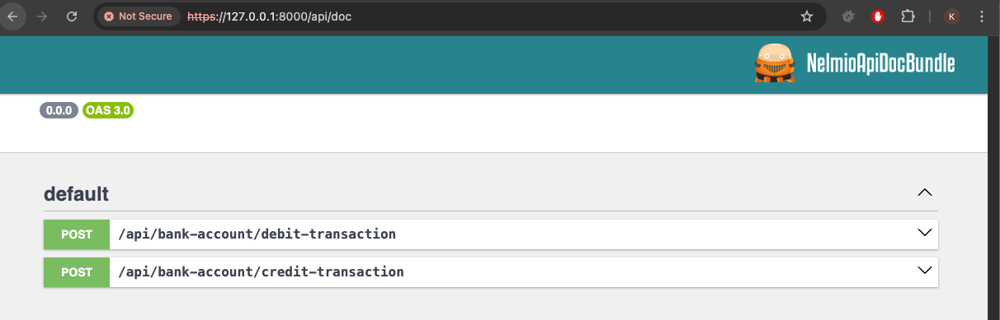

# Introduction
An application based on the banking system was created under the guidelines. The main operations to be found there are the Credit and Debit operations.

Before I start describing the application, an important note.
The application uses amounts as integers. For example, EUR 10 will be stored in the database as 1000 (1000 cents), the same for other currencies. There are many positive aspects of this choice e.g. performance of SQL Quaries during couting/suming values from transactions and also important advantages is the exclusion of the possibility of numerical errors on floating-point numbers.
Of course there are also disvantages this solution if for example we want to store value with more than two decimal places. For example counting value and exchange currency rate (5000 x 4,2352).
I have taken the liberty of using this solution because it is correct for these requirements, but I am aware of the cases for which it will not works correctly.

# Configuration
1. Clone the repository
3. Install the requirements (composer install)
4. Create a database and configure the .env file (php bin/console d:m:m)
5. Run the server (symfony server:start)
6. Go to database and insert bank account with balance
<pre>INSERT INTO `bank_account` (`id`, `owner_id`, `balance`, `account_number`, `currency`) 
VALUES ('331751d0-30dd-4196-b79c-3166064fc273', 'd5f457aa-c70d-4f9c-99d2-75310d37ac1e', '0', '51604306496154642739047892' ,'EUR');</pre>
7. Go to the browser and enter the address: https://127.0.0.1:8000/api/doc. There is a swagger with all endpoints and require payloads. 

8. We can also run the tests (php bin/phpunit)

# Summary

My goal was to implement application based on DDD and framework agnostics (as was in the requirements).
The domain layer is not dependent on the Symfony framework. It is possible to use it in other frameworks.
The application is based on the CQRS pattern and command bus is used to handle commands.

# TODO
1. Implement Query bus
2. Implement GET endpoints
3. Implement E2E tests for the endpoints (e.g using InMemoryRepository pattern or use the real database e.g. SQLite)
4. Implement more unit tests for classes from the infrastructure layer
4. Implement the event bus (e.g. for sending emails)
5. Implement the read model (e.g. for storing the data in the way that is easy to read)
6. Implement the asynchronous command bus (e.g. for handling the commands in the background)
